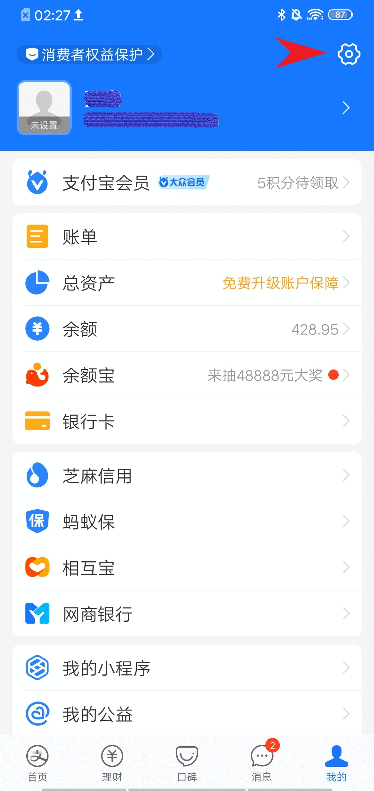

# 基于Auto.js的支付宝批量自动转账脚本
这是一个能够实现支付宝多账号自动转账脚本，可以自动给多个指定用户自动转账，非商家用户不能申请支付宝的支付Api,另辟蹊径，使用Auto.js模拟手动操作支付宝实现转账功能.
## 效果演示


由于Auto.js程序受支付宝版本影响较大，效果演示的支付宝版本号为10.2.30.

# Getting Started 使用指南


## 手机设置
脚本通过模拟手动点击的方式实现转账功能,因此使用脚本必须将支付宝设置为密码支付,关闭生物支付.



## 参数设置

在main.js中设置支付宝的支付密码
```js
var password = "XXXXXX"
```
将需要转帐的手机号写在`phone.txt`中,每行包含一个账户信息和转账金额，使用逗号隔开
```txt
173XXXX5221,12
173XXXX5681,25
```

